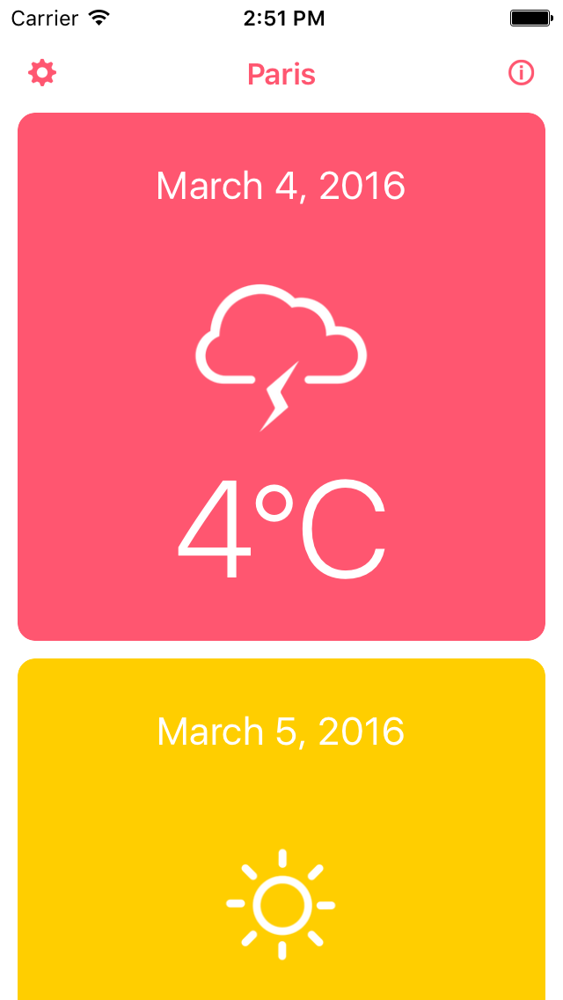
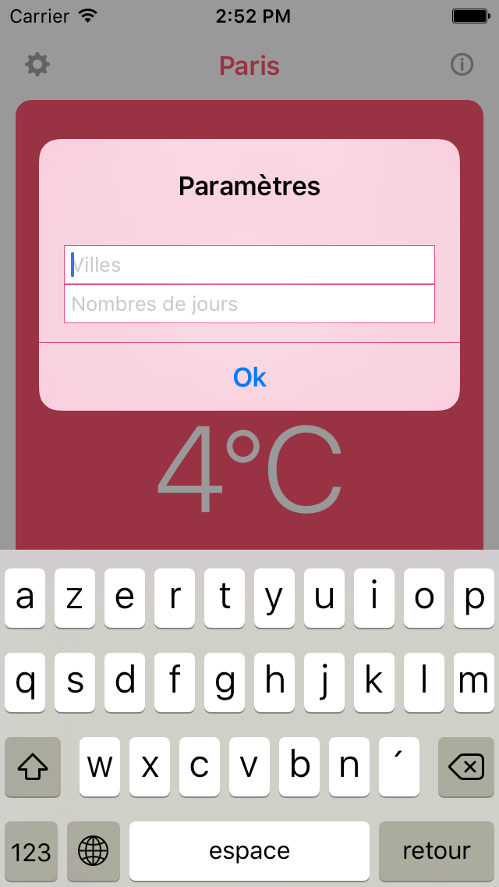
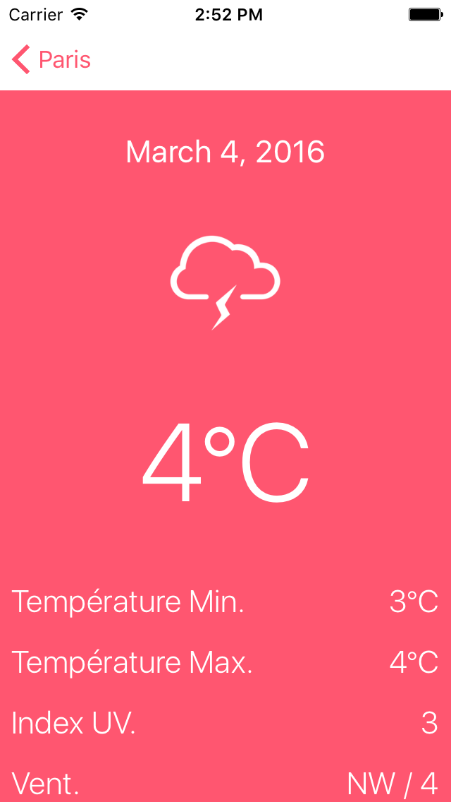

# WheathR


Vous vous apprêtez à effectuer un test technique créé par Smart&Soft.

## Avant de commencer
Assurez-vous que votre environnement est à jour pour développer avec les versions suivantes :

* Xcode 9.2 ou supérieur (simulateur iPhone X)
* Cocoapods 1.3.1 ou supérieur
* Swift 4 ou supérieur
* iOS 10 et supérieur
* iPhone et iPad 

Pour aborder le test sereinement, il convient également d'avoir :

* Un compte Github.
* Un outil vous permettant une interaction avec un dépôt git et notamment les actions suivantes : clonage d'un dépôt, création d'une branche, commit, push et création d'un tag.

## Consignes

Ce dépôt contient deux choses :

* Le code source Swift d'une application iOS développée sous Xcode et qui vous servira de base pour effectuer ce test technique .
* Un fichier ReadME qui contient les consignes de chacun des exercices qui vous seront demandés dans ce test technique.

Cet entretien technique se composant de plusieurs questions / exercices, il convient de réaliser un commit par exercice avant de mettre en avant l'avancement du projet et mettre en lumière le code mis en place pour chacun des exercices proposés.


## Points d'attention

- 1- Les exercices s'enchaînent de manière logique. Il convient donc, dans la mesure du possible, de les réaliser dans l'ordre dans lequel ils apparaissent dans ce document.
- 2- Afin de vous évaluer, pensez à **commiter régulièrement** vos travaux et votre avancée pendant ou après chaque exercice.
- 3- Prennez le soin d'avoir une bonne **gestion des erreurs** avec le WebService qui vous est fourni.
- 4- N'hésitez pas à effectuer une revue de code ou tout changement qui vous parait pertinent. **Laissez vos commentaires de réflexion dans ce ReadMe. Voir la section "Observations personnelles"**.
- 5- **Ce test est le reflet de votre manière de penser, structurer et organiser votre code dans une app**. Même petite comme celle-ci, prennez le temps de faire les exercices et l'application et de montrer ce que vous savez faire. Surtout, prennez du plaisir à le faire ;)


## Présentation du projet

### Présentation fonctionnelle

WeathR est une application universelle **iPhone et iPad**, permettant de connaître la météo fictive de trois grandes villes, à savoir Paris, Londres et Milan, sur les cinq à dix prochains jours. 

**Pensez à la rendre compatible universelle et suivant les différentes tailles d'appareils.**
**Sur iPad, l'application devra afficher les vignettes sur plusieurs colonnes.**

Cette application se compose de 3 écrans :

* L'écran "home" qui affiche sous la forme d'une liste les prévisions météo de la ville active.
* L'écran "détail" qui affiche de manière plus détaillée les prévisions météo d'une journée spécifique. On y accède en cliquant sur un item de la liste exposée par l'écran "home".
* L'écran "about", accessible depuis la navigation bar de la "home", qui permet d'afficher quelques informations relatives à l'éditeur de l'application, à savoir Smart&Soft.

Cette application se compose également d'une popup permettant de paramétrer la ville pour laquelle on souhaite connaître la météo, ainsi que le nombre de jour à afficher (entre cinq et dix). Cette popup est accessible depuis la "home", en cliquant sur la roue dentée depuis la navigation bar.

Les données de l'application sont récupérées depuis un web-service.

Pour mieux vous rendre compte du contenu de l'application, voici quelques captures d'écran :

#### Accueil




#### Paramètres




#### Détails




#### À propos *(aucun travail est demandé sur ce dernier écran)*


## Présentation technique
### Le web-service

Comme précisé précédemment, les données permettant d'alimenter l'application sont issues d'un web-service : http://smartnsoft.com/shared/weather/index.php?city={city}&forecasts={forecasts}

```

*Info*

city : String, la ville souhaitée (Paris, Londres ou Milan).
forecasts : String, indique le nombre de jours souhaités, (entre 5 à 10 jours)
```

Voici un exemple d'appel et du JSON retourné :

```
{
  "code": 200,
  "message": "OK",
  "city": "paris",
  "forecasts": [   
    {
      "date": "2015-12-10",
      "temperatureMin": 10,
      "temperatureMax": 12,
      "type": "SUNNY",
      "uvIndex": 12,
      "windDirection": "W",
      "windSpeed": 10   
    },   
    {
      "date": "2015-12-11",
      "temperatureMin": 11,
      "temperatureMax": 12,
      "type": "CLOUDY",
      "uvIndex": 12,
      "windDirection": "E",
      "windSpeed": 11
    },   
    {
      "date": "2015-12-12",
      "temperatureMin": 12,
      "temperatureMax": 12,
      "type": "RAINY",
      "uvIndex": 12,
      "windDirection": "NW",
      "windSpeed": 12
    },  
    {
     "date": "2015-12-13",
     "temperatureMin": 12,
     "temperatureMax": 13,
     "type": "SNOWY",
     "uvIndex": 12,
     "windDirection": "SW",
     "windSpeed": 13
   },
   {
      "date": "2015-12-14",
      "temperatureMin": 12,
      "temperatureMax": 14,
      "type": "STORMY",
      "uvIndex": 12,
      "windDirection": "NE",
      "windSpeed": 14
   }
  ]
}
```

## Architecture de l'application iOS

### Exercice 0

À partir du JSON fourni, créer les objets métiers **Forecast** et **Weather** puis préparer l'appel réseau afin de récupérer les données météo.

### Exercice 1

Afficher la météo par jour en complétant la classe **HomeViewController** en s'appuyant sur la maquette [Accueil](#homeAnchor). Pour rappel, le nombre de jours affichés est variable.

Ouvrir les [Paramètres](#settingsAnchor) à partir du bouton représenté par une roue dentée.

Ouvrir l'écran [Détails](#detailsAnchor) lors de l'appui sur une cellule. Cet écran est représenté par la classe **HomeDetailsViewController** et doit recevoir à son ouverture deux paramètres, la météo et la couleur d'arrière-plan de la vignette sélectionée.


### Exercice 2

Réaliser l'écran de détail en complétant la classe **HomeDetailsViewController** en s'appuyant sur la maquette [Détails](#detailsAnchor)


### Exercice 3

Persister les données météo afin que l'application puisse afficher les dernières données récupérées lorsqu'il n'y a plus de connexion Internet

```
*Important*

L'utilisation de NSUserDefaults est formellement interdite tout comme NSKeyedArchiver.
```

### Exercice 4

Nous souhaitons que l'application soit également disponible pour les anglophones. Internationaliser l'application en anglais.

## Observations personnelles

Commenter ici votre réflexion, vos choix techniques et vos remarques.
